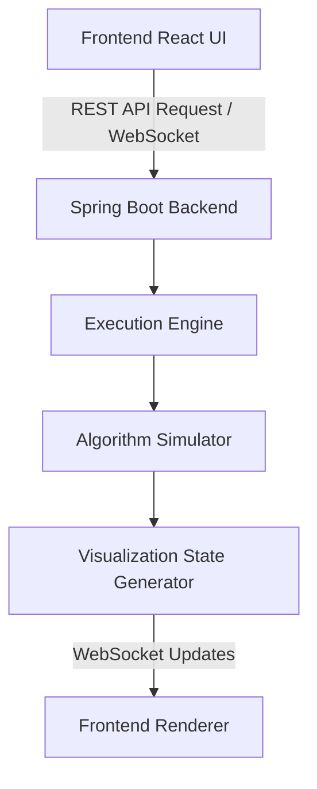

<div align="center">
  
  <h1>🧠 AlgoMind AI</h1>
  <p><em>The ultimate AI-powered algorithm learning and visualization platform for coding interviews.</em></p>

  <p>
    <a href="https://github.com/SAICHARAN1205/AlgoMind-AI/stargazers"></a>
    <a href="https://github.com/SAICHARAN1205/AlgoMind-AI/network/members"></a>
    
    
    
    
    
    
    
    <a href="https://opensource.org/licenses/MIT"></a>
  </p>
</div>

---

## 📖 Project Overview

**AlgoMind AI** is an advanced AI-powered algorithm learning and visualization platform specifically designed for students preparing for coding interviews. It bridges the gap between static code and dynamic execution, bringing data structures and algorithms to life.

With AlgoMind AI, users can:
- 👁️ **Learn algorithms visually** with dynamic, step-by-step animations.
- 💻 **Paste their own code** (Java) and watch the platform trace and execute it.
- ⏯️ **Watch execution step by step** to deeply understand the control flow.
- ⏱️ **Understand time complexity** with intuitive explanations.
- 🤖 **Learn through AI explanations** acting as a personalized 24/7 coding mentor.

---

## ✨ Key Features

<details>
<summary>🎓 <b>Learning Mode</b> <i>(Click to expand)</i></summary>

- **Interactive algorithm visualizations**
- **Step-by-step execution** with play, pause, resume, next, and previous step controls.
- **Restart execution** and adjust playback speed.
- **Variable tracking** and **pseudocode synchronization**.
- **Execution timeline** to track the state history.
- **Complexity explanation** and **AI Mentor support**.
- **Beginner-friendly interface**.
</details>

<details>
<summary>💻 <b>Code Visualizer</b> <i>(Click to expand)</i></summary>

- **Paste Java code** with automatic algorithm detection.
- **Dynamic execution** and **execution tracing**.
- Comprehensive state tracking: **Variable**, **Array**, **Queue**, **Stack**, **Binary Tree**, **DP table**, and **Graph visualization**.
- **Code explanation** and **execution timeline**.
- **AI-generated explanations** for custom code.
</details>

<details>
<summary>🤖 <b>AI Mentor</b> <i>(Click to expand)</i></summary>

- Explains **algorithms**, **code**, **time complexity**, and **space complexity**.
- Provides **optimization suggestions**, **common interview questions**, and identifies **edge cases**.
- Offers **dry run explanations**, **debugging hints**, and **personalized learning support**.
</details>

<details>
<summary>🧮 <b>Supported Algorithms</b> <i>(Click to expand)</i></summary>

| Category | Algorithms |
|---|---|
| **Sorting** | Bubble Sort, Selection Sort, Insertion Sort, Merge Sort |
| **Searching** | Binary Search |
| **Graphs** | BFS, DFS, Dijkstra |
| **Dynamic Programming** | Fibonacci (Memoization & Bottom-Up), Knapsack, Longest Common Subsequence |
| **Trees** | Binary Search Tree, Tree Traversals |
| **Recursion** | Fibonacci, Factorial |
| **Arrays** | Reverse Array |
| **Data Structures** | Queue, Stack |
</details>

<details>
<summary>⚙️ <b>Backend Features</b> <i>(Click to expand)</i></summary>

- **Spring Boot REST APIs** & **WebSocket communication**.
- **Modular simulator architecture** featuring: Execution Engine, Dynamic Code Simulator, Algorithm Detection Engine, Parser Factory, and Safe Execution Interpreter.
- **Variable Tracker** & **Execution Timeline**.
- **Session Management** & **Exception Handling**.
- **DTO architecture**, **AI Provider abstraction**, and an **extensible simulator framework**.
</details>

<details>
<summary>🎨 <b>Frontend Features</b> <i>(Click to expand)</i></summary>

- Built with **React + Vite** for a modern, responsive UI.
- **Interactive visualizations** with dynamic animations.
- **Monaco-style code editor**.
- Dedicated panels: **AI Mentor Sidebar**, **Playback Controls**, **Visualization Panels**, **Execution State rendering**, and **Timeline UI**.
</details>

<details>
<summary>🧠 <b>AI Features</b> <i>(Click to expand)</i></summary>

AlgoMind AI abstracts the AI layer, allowing support for multiple providers:
- **Gemini**
- **OpenAI**
- **OpenRouter**
- **DeepSeek**
- **Grok**

Features include **provider abstraction**, easy **environment variable configuration**, and **AI fallback mode**.
</details>

---

## 🏗️ Architecture

AlgoMind AI uses a robust client-server architecture with real-time WebSocket communication for step-by-step execution rendering.



---

## 📁 Project Structure

```text
AlgoMind-AI/
├── frontend/                 # React + Vite Application
│   ├── src/
│   │   ├── components/       # Reusable UI components
│   │   ├── pages/            # Application routes/pages
│   │   ├── services/         # API and WebSocket clients
│   │   ├── store/            # State management
│   │   └── utils/            # Helper functions
│   └── package.json
└── backend/                  # Spring Boot Application
    ├── src/main/java/
    │   └── com/algomind/
    │       ├── api/          # REST Controllers
    │       ├── engine/       # Execution Engine & Simulators
    │       ├── models/       # Entities & DTOs
    │       ├── services/     # Business logic & AI Providers
    │       └── websocket/    # WebSocket handlers
    └── pom.xml
```

---

## 🛠️ Technology Stack

| Domain | Technologies |
| :--- | :--- |
| **Backend** | Java, Spring Boot, WebSocket, REST APIs |
| **Frontend** | React, Vite, CSS/Tailwind, Monaco Editor |
| **AI Integration** | Gemini, OpenAI, OpenRouter, DeepSeek, Grok APIs |
| **Build & Tools** | Maven, npm/Yarn, Git |

---

## 🚀 Installation

### 1. Clone the repository
```bash
git clone https://github.com/SAICHARAN1205/AlgoMind-AI.git
cd AlgoMind-AI
```

### 2. Backend Setup
Make sure you have Java 17+ and Maven installed.
```bash
cd backend
mvn clean install
```

### 3. Frontend Setup
Make sure you have Node.js 18+ installed.
```bash
cd frontend
npm install
```

### 4. Environment Variables
Create an `application.properties` or `.env` file for the backend and configure your API keys (see [Environment Variables](#-environment-variables)).

### 5. Run the Application

**Run Backend:**
```bash
cd backend
mvn spring-boot:run
```

**Run Frontend:**
```bash
cd frontend
npm run dev
```

---

## 🔐 Environment Variables

AlgoMind AI allows you to configure which AI provider to use. Set these variables in your backend environment:

| Variable | Description |
| :--- | :--- |
| `ACTIVE_AI_PROVIDER` | Determines which AI to use (e.g., `gemini`, `openai`, `deepseek`). |
| `GEMINI_API_KEY` | API Key for Google Gemini. |
| `OPENAI_API_KEY` | API Key for OpenAI (ChatGPT). |
| `OPENROUTER_API_KEY` | API Key for OpenRouter. |
| `DEEPSEEK_API_KEY` | API Key for DeepSeek. |
| `GROK_API_KEY` | API Key for Grok (xAI). |

---

## 📸 Screenshots

> *Note: Add your actual screenshots to the `assets/` folder and update these placeholders!*

<details>
<summary><b>Landing Page</b></summary>

</details>

<details>
<summary><b>Learning Mode</b></summary>

</details>

<details>
<summary><b>Code Visualizer</b></summary>

</details>

<details>
<summary><b>AI Mentor</b></summary>

</details>

<details>
<summary><b>Graph Visualization</b></summary>

</details>

<details>
<summary><b>DP Visualization</b></summary>

</details>

---

## 🗺️ Future Roadmap

- [ ] More algorithms (Advanced Graphs, String Matching)
- [ ] Multi-language support (Python, C++, JavaScript)
- [ ] Compiler integration
- [ ] Custom input visualizer
- [ ] Competitive Programming mode
- [ ] AI Interview mode
- [ ] Quiz mode
- [ ] Collaborative learning (multiplayer sessions)
- [ ] User progress tracking
- [ ] Export visualizations as GIF/Video
- [ ] Mobile support

---

## 💡 Why AlgoMind AI?

While traditional algorithm visualizers are static and only show predefined examples, **AlgoMind AI** bridges the gap between passive viewing and active learning. 

By allowing you to **paste your own Java code**, rendering **dynamic execution state**, and coupling it with an **AI Mentor** that explains time complexity and bugs in real-time, it acts as a true companion for coding interviews rather than just a visualization toy.

---

## 🤝 Contributing

Contributions make the open-source community such an amazing place to learn, inspire, and create. Any contributions you make are **greatly appreciated**.

1. Fork the Project
2. Create your Feature Branch (`git checkout -b feature/AmazingFeature`)
3. Commit your Changes (`git commit -m 'Add some AmazingFeature'`)
4. Push to the Branch (`git push origin feature/AmazingFeature`)
5. Open a Pull Request

---

## 📄 License

Distributed under the MIT License. See `LICENSE` for more information.

---

## 👨‍💻 Author

**Anantharapu Saicharan**

[](https://github.com/SAICHARAN1205)

---
<div align="center">
  <i>Built with ❤️ for algorithm learners worldwide.</i>
</div>
